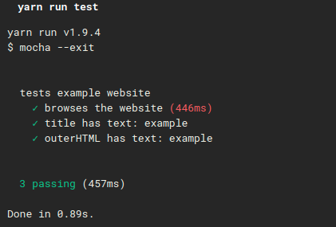
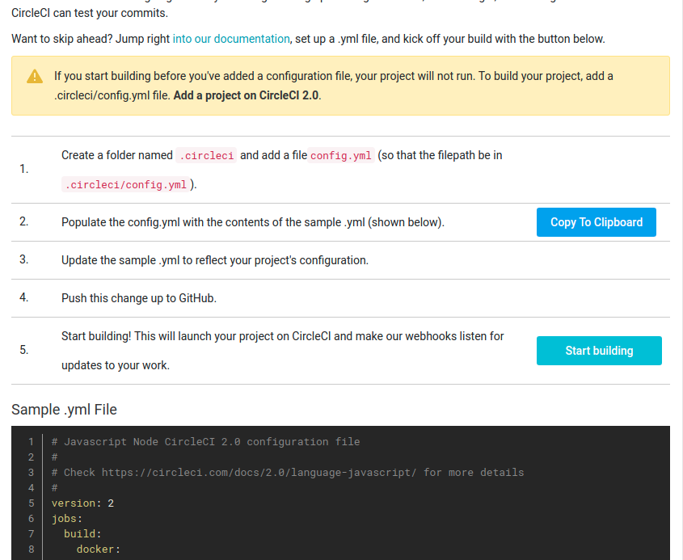
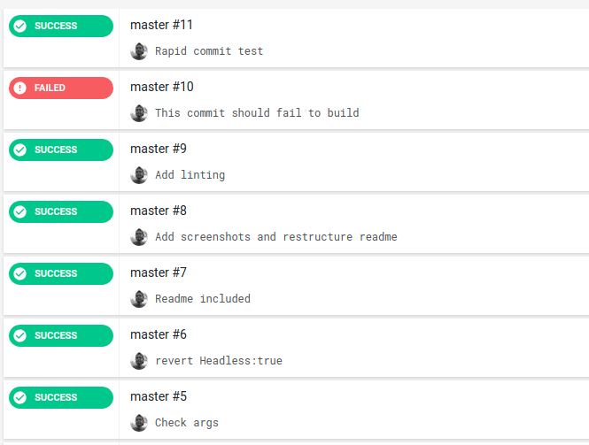

# Prefech

A sample repo to show how mocha, puppeteer and a ci can be used to automate various tests. Maybe an automation script was created, but depending on the size of project even that script should be tested to make sure everything works as expected when there is a commit pushed. 

We can build this using BDD, TDD or any other methodology, but whatever method is being used, the steps will always include, 
- Creating actual/automation script
- Creating test/mocha script
- Creating/Preparing CI environment

Right now most CI and servers always prepares the Xvfb and other required libraries, so we don't have to deal with them too much unless explicitely required.

NOTE: This readme/post will avoid going into depth and only discuss matters on top, assuming you already know about nodejs, unit testing, mocha/chai, puppeteer and CI. You don't have to know everything, just having the basics will be enough.

# Why tests? 

Yeah, why we are just making simple automation scripts?
Right now we are testing only a sample function. It doesn't seem much. However, imagine 100 scripts or thousand scripts. Is it possible for you to run and test every single script to make sure it works? It won't be possible, and it will become a very stupid headache once that happens. So, even if you don't need these kind of tests, they will help you on long run once you have to do same thing over and over again. 

If you are building a scraper, and have to browse 100 sites or fill 100 forms, it will help when you got to know the script works and can reach the target website/forms when possible. It will also alert you when things goes south.

# Basic example script

We will create a sample script that will browse example website, extract title and outerHTML and close itself. We will treat the script as an independent one, so we won't be dealing with the closing/opening the browser on the testing environment, rather it will just be there to show how it works.

## Creating the actual script

We will use node 8 with async-await support, and puppeteer for this. 

Basically what we will do is,
- Launch the browser.
- Navigate to website
- Collect title and outerHTML for testing purpose
- Close browser and cleanup the processes
- Return the data

Check out the `app/grab-data.js` for the commented out code. 

## Creating test script

When using unit tests, it's important to use timeouts. Make sure to exit the tests, and use proper timeout. Recent mocha will not exit the tests, in that case or in a case where you have infinite timeout, you might end up with a huge cost for the test getting stuck. Mocha by default will run tests one by one. If you want to try asyncronous tests, you can use Ava. Both are fantastic in their own way, popular and has huge support.

You do not need to test every single thing on automation scripts. Just make sure the scripts works at very basic level for each possible scenerio. If you push 100 commits and the automation script has login and such, it will end up doing 100 logins in very short amount of time, and trigger various alerts, unless it's your website you are testing against.

We will create the test script with the actual user flow in mind. Check the `test/basic.js` for test code. 



## Code linting

Sometimes you want to make sure the quality of the work is well and you are not pushing garbaze inconsistant code to your repo. If you have multiple contributors to the repo you can even make sure their code passes all linting tests (excluding all eslint-disable hacks), and it returns safely. 
Thus we are simply gonna use `eslint --init`, and follow the wizard to install airbnb rules, and then `eslint --fix . --ext .js` for auto fixing basic problems. 

Also we can include these in the scripts inside `package.json` and simply call it later on. 

Since we have mocha and node as target, we have to manually edit things a bit and add `node` and `mocha` as the target environment. Otherwise it will throw errors like,

```
'describe' is not defined 
```

And since we are using browser code inside puppeteer, it will throw errors like how `document is not defined` and such. We need to include `browser` as targets too, or apply workarounds.

We are all good once we put and lint it. It might throw on some small warnings about best practices, we can fix them if we want, or move on.

## Creating/Preparing CI environment

Headless is a big factor on browsing and testing. Sometimes headless will leave a big footprint and get caught as bot, otherwise it's perfect for testing own websites where we can explicitly exclude it for testing. Enabling headless will take 6+ seconds to launch on CI environment sometimes, while disabling headless will reduce the time to 1 second. It can be optimized and hacked thru. While this doesn't seem like a big deal, it is indeed a big deal if you have a tight budget and CI costs are really high. Most CI gives you free time to run, but it will quickly add up where you have almost limited resource.

CircleCI has `node:8.12.0-browsers` and other similar tags that includes the required libraries for headless and xvfb display. Just using their wizerd is enough to get you going. 

We will need to include the linting, and then we will run the actual test, make sure it's good quality code and works well, without running it ourselves on our own machine. We can even apply the fixing if we are brave enough.

Check out `.circleci/config.yml` for the code. 



The result looks beautiful,


## Final steps

So far we almost copy pasted everything or followed wizerd and everything was done. We just need to setup the actual project on circleCI and link the repo. Then push the repo will trigger the build. 

That wasn't hard, was it?

# It triggers on every commit
It will be very bad to trigger hundreds or thousands of tests on every commit/push. Sometimes you will just update the readme files and won't want to trigger things. And sometimes you will want to trigger only after making a major change. To prevent such worse things from happening, make sure to push to a seperate branch and do pull request only if you are satisfied with current code changes. Merging to master branch will trigger the build, which also can be setup as various webhooks and breaking measurements.

So far this repo did not need such a big readme, but I ended up writing it because I was very lazy at writing documentations and ended up confused whenever I needed some script from some old repo to use. Later I will be able to extend this repo with process management, queue management, docker builds and server deployments. So much potential.